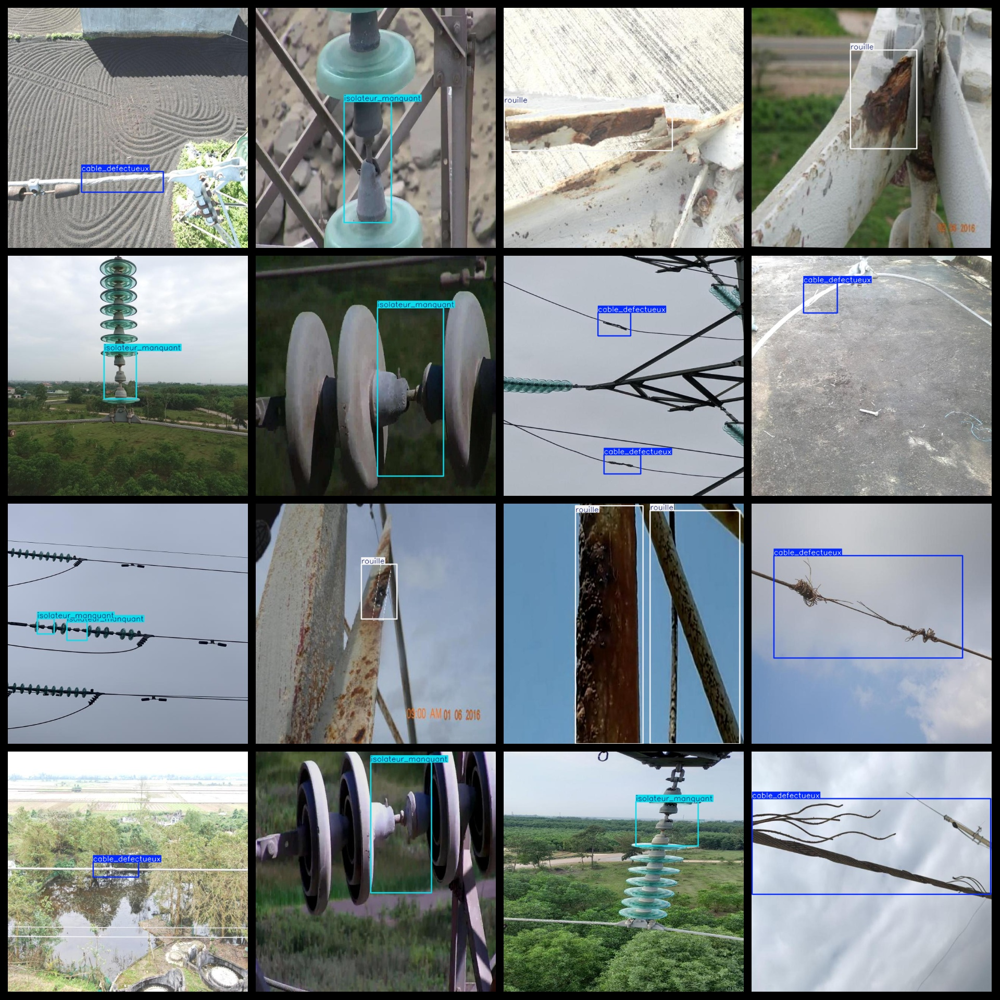
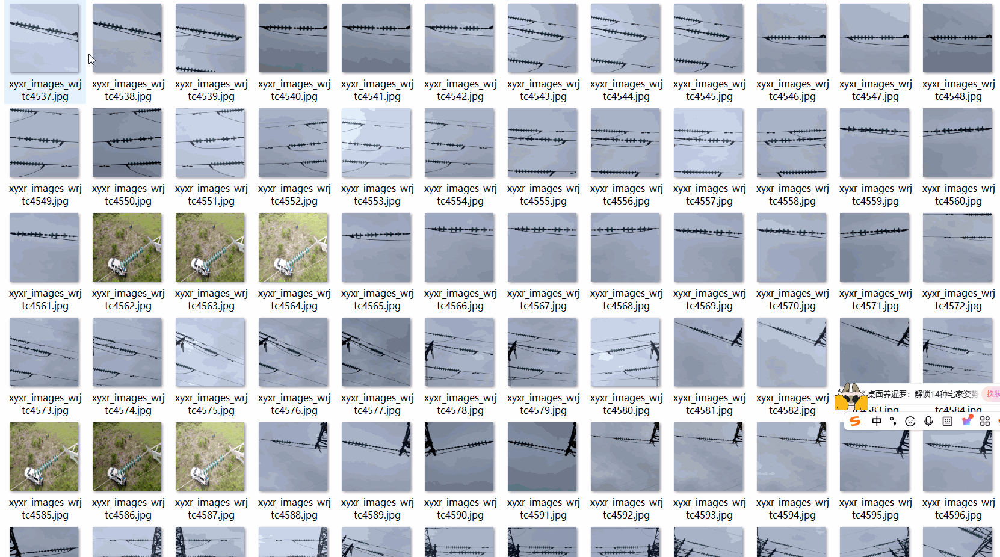

# UAV Aerial Power Equipment Defect Detection Dataset 8487 Images 3-class Defect YOLO-VOC format

The UAV Aerial Power Equipment Defect Detection Dataset consists of 8487 images, organized in three classes: cable defect, isolateur manquant, and rouille. The dataset follows the VOC format and YOLO format for both image classification and object detection.

The dataset includes three folders within a zip file: JPEGImages, Annotations, and labels. The JPEGImages folder contains a total of 8487 JPEG images, while the Annotations folder contains an equal number of XML files. The labels folder contains a total of 8487 txt files.

The dataset features 3 types of labels: "cable_defectueux", "isolateur_manquant", and "rouille". Each label corresponds to a specific defect type as specified in the labels folder's classes.txt file.

Here are the frame counts (note that the order of categories in the yolo format might differ from this list but is consistent with the classes.txt in the labels folder):

- Cable_defectueux: 4044
- Isolateur_manquant: 3080
- Rouille: 2584

The total frame count is 9708.

All images are of high resolution clarity, enhanced for training models or weights.

The labels are square boxes used for target detection recognition.

Special Notes: No guarantees are made about the accuracy or precision of any models trained on this dataset or its weights. The dataset only provides accurate and reasonable annotations.

Important Notice: This dataset does not guarantee any level of accuracy or precision in the training of any model or weight files. The data is provided strictly for accurate and reasonable annotation.

Additional Information:
- Image Acquisition Details: The images were collected using a UAV equipped with cameras capable of capturing high-resolution images.
- Annotation Process: The images were annotated by human annotators to ensure accurate and consistent labeling across all images.
- Data Quality: The dataset is of high quality, ensuring that the labels are well-defined and the images are accurately represented.

## Images

---

Here is a pay link on Stripe (https://buy.stripe.com/3cs8yP7sY87d0vu9AB). Please contact me lonlonago@foxmail.com after funding $89, and I will send you a complete data files, thank you!

